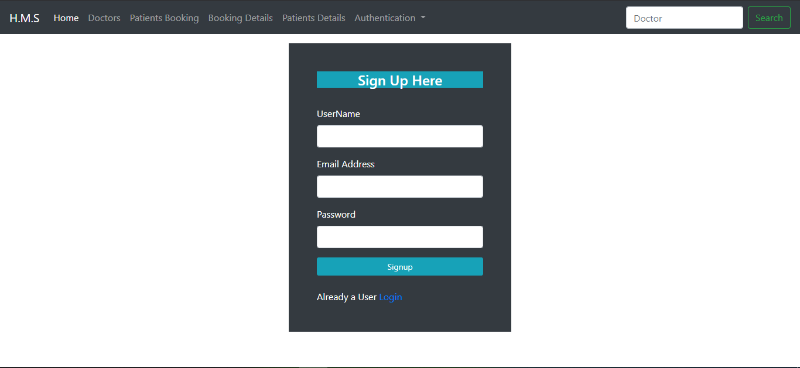
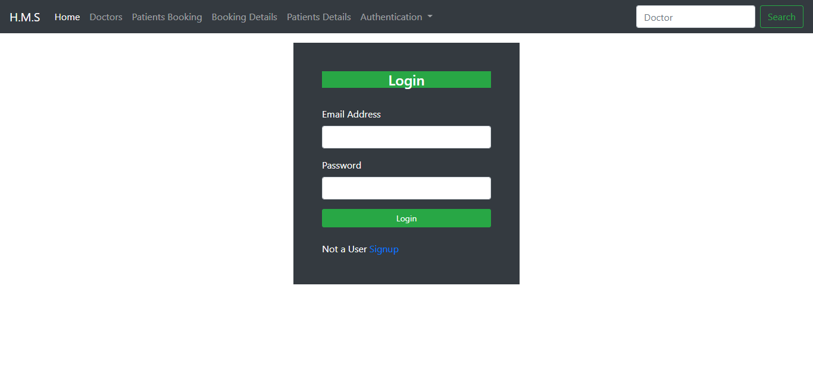
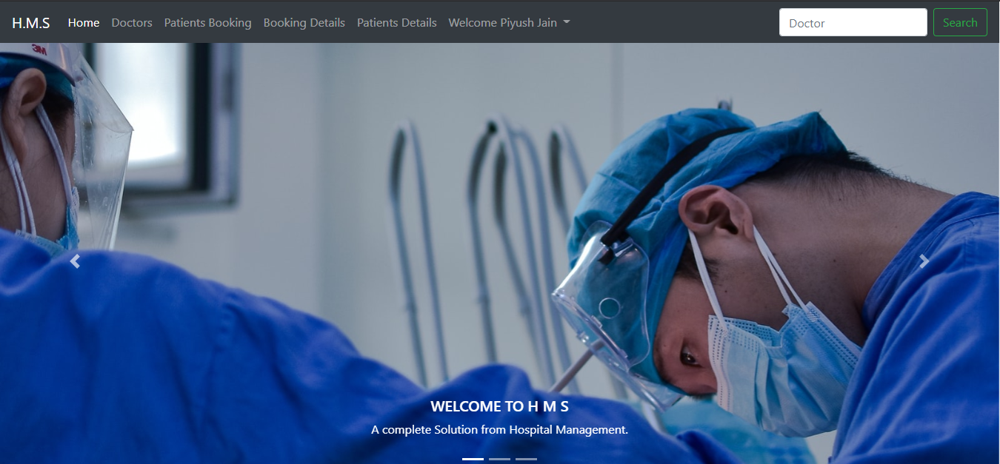
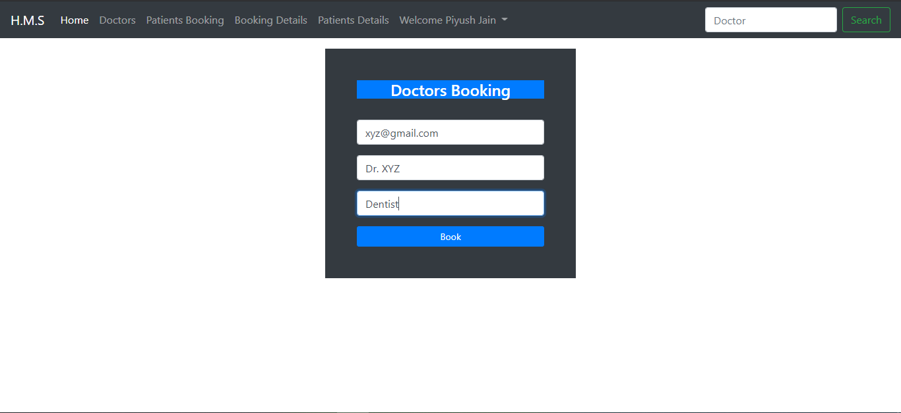
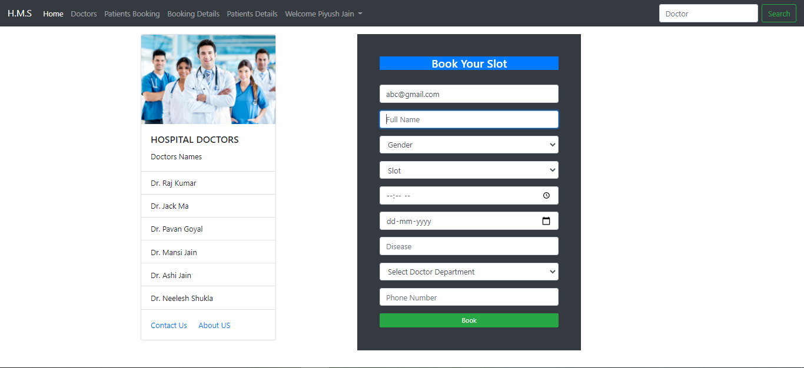
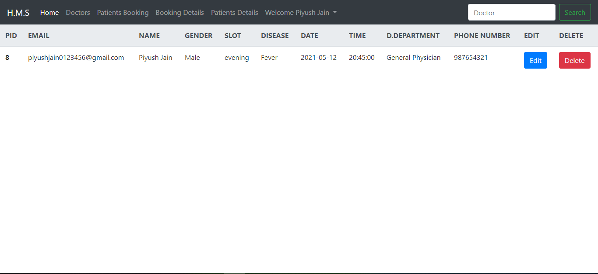
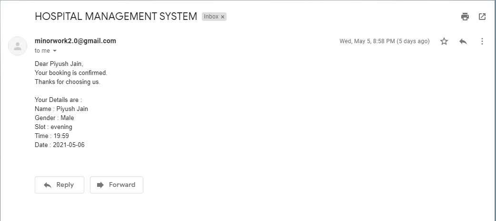

# HospitalManagementSystem
HospitalManagementSystem is a Python Flask Project.
<h2>Technology Used</h2>
  <ul>
    <li>Python</li>
  <li>Flask</li>
    <li>HTML</li>
    <li>Bootstrap</li>
    <li>Mysql</li>
  </ul>

The flask Python website that manage:

<ul>
  <li>User's records</li>
<li>Patients records</li>
<li>Doctors records</li>
<li>Appoinments records</li>
</ul>

when the user book an appoinment. All the appoinments details are sent to the email provided by the user. 

To run this website on your local machine, You need to install requirements.txt by using 
<b><i>pip install -r requirements.txt<i></b> command. 
After installing above dependencies you can run the server using 
  <b><i>$ python main.py</i></b> 
and open the website on localhost using port number shown in the terminal.

<h2>Screen Shots<h2>
  <h3>Signup Page</h3>
 
  <h3>Login Page</h3>
 
  <h3>Home Page</h3>
 
  <h3>Doctors Booking Page</h3>
 
  <h3>Patient Booking Page</h3>
 
  <h3>Booking Details Page</h3>
 
  <h3>Patient Booking Page</h3>
 
  <h3>Mail Sent to User</h3>
 
